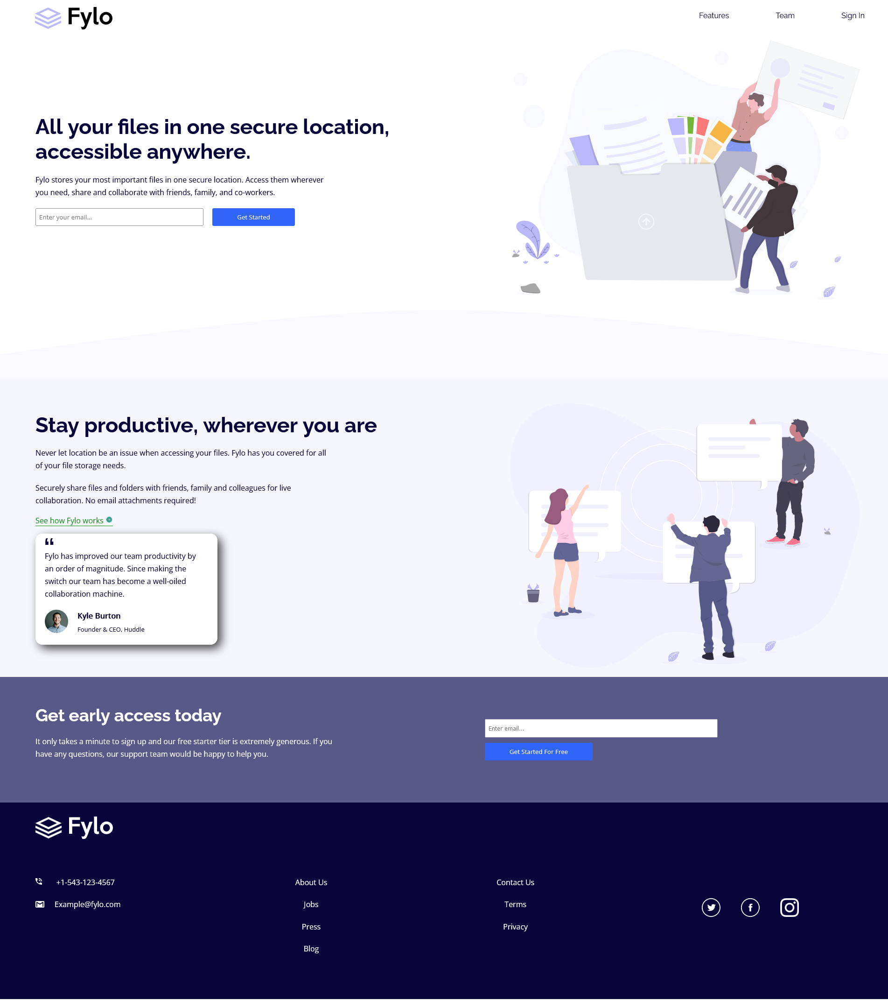
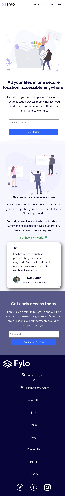

# Frontend Mentor - Fylo landing page with two column layout solution

This is a solution to the [Fylo landing page with two column layout challenge on Frontend Mentor](https://www.frontendmentor.io/challenges/fylo-landing-page-with-two-column-layout-5ca5ef041e82137ec91a50f5). Frontend Mentor challenges help you improve your coding skills by building realistic projects. 

## Table of contents

- [Overview](#overview)
  - [The challenge](#the-challenge)
  - [Screenshot](#screenshot)
  - [Links](#links)
- [My process](#my-process)
  - [Built with](#built-with)
  - [What I learned](#what-i-learned)
  - [Continued development](#continued-development)
  - [Useful resources](#useful-resources)
- [Author](#author)

## Overview
I created this Frontend Mentor challenge to help me improve my code. This challenge is focused on making a landing page that is responsive and reactive feature when using it.

### The challenge

Users should be able to:

- View the optimal layout for the site depending on their device's screen size
- See hover states for all interactive elements on the page

### Screenshot



Above is a screenshot of the desktop version of the landing page. 



Above is a screenshot of the mobile version of the landing page 

### Links

- Live Site URL: [Fylo landing Page](https://j-wil21.github.io/Flyo-LandingPage/)

## My process

There was a lot to build initially when I looked at the design images, but I took my time and started from the nav and worked my way down. I made sure that the HTML5 Markup was set up properly so I could style the different elements using CSS.

### Built with

- Semantic HTML5 markup
- CSS
- Flexbox
- CSS Grid


### What I learned

The point I feel like I learnt the most would be when to put ```<div> ``` elements.
The reason for this is because I needed to make the page responsive and what would work for the desktop version wouldn't work on the mobile version, so I found myself added div's in order to fix that.

An example would be when I didn't put a div around the first section of the landing page. I added it after so I could do 'column-reserve' on 'flex-direction'. This allowed me to show the content in the correct order when the landing page is opened on the mobile version. 
Examples below:
```html
<section class="flex_files">
      <div class="files">
        <h1>All your files in one secure location, accessible anywhere.</h1>

        <p>Fylo stores your most important files in one secure location.
          Access them wherever you need, share and collaborate with friends,
          family, and co-workers.</p>
        <form>
          <input type="email" id="email" placeholder="Enter your email..." required>
          <button class="btn1" for="email">Get Started</button>
        </form>
      </div>
      
```
CSS code:
```css
.flex_files {
        margin-top: 100px;
        padding: 20px 0;
        display: flex;
        flex-direction: column-reverse;
        flex-wrap: wrap;
        align-items: center;
    }
```

### Continued development

I want to continue learning how to use HTML5 markup in the most efficient way possible to allow me to style the sheet in a simple and easy way. I would also like to work on using less code by being more efficient in writing code.

### Useful resources

- [MDN web docs](https://developer.mozilla.org/en-US/docs/Web/CSS/Media_Queries/Using_media_queries) - This helped me when I needed to implement media queries, transitions, CSS grid, flexbox. Straight forward and easy explanation for me.

## Author
Created by Joshua.
- Git - [Joshua W.](https://github.com/J-Wil21)
- Frontend Mentor - [@J-Wil21](https://www.frontendmentor.io/profile/J-Wil21)


